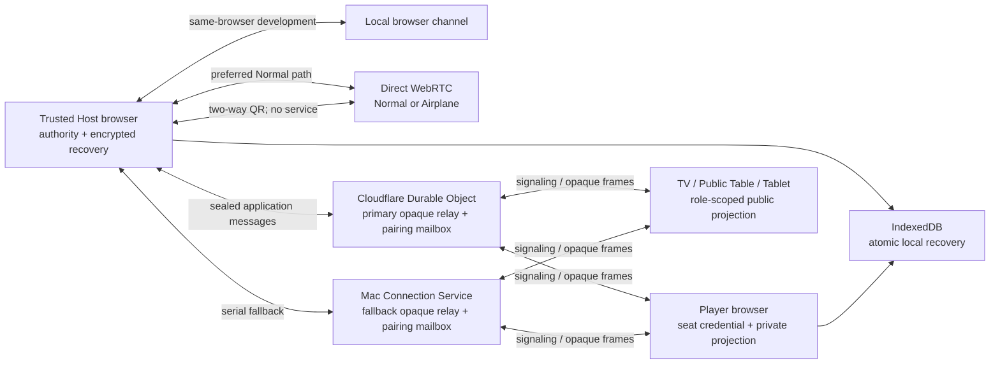

# Phase 1 runtime architecture

**Status:** Local implementation reference. It describes the current code and automated evidence; the Phase 1 PRD remains normative. **Audience:** contributors and deployers. **Update when:** a trust boundary, transport, recovery artifact, or release format changes.

## Runtime shape

The diagram is a route map, not a claim that every route is available on every network. Game Core, Card Custody, identity/capabilities, persistence, diagnostics, and presentation remain separate packages; `apps/web` composes their browser adapters.

## Normal Mode

1. The host creates a binding containing the table ID, host key, build version, and protocol version.
2. When a deployer configures one or both relay URLs, the host sends its private operator token directly to each configured `/v1/table-sessions` endpoint to receive independent random, table-and-peer-bound relay tickets. The static web configuration contains URLs only.
3. Invitation fragments carry the scoped relay ticket, table binding, one-use invitation token, and requested role. Fragments are not sent in ordinary HTTP requests, but they remain sensitive local data.
4. The client authenticates its invitation/credential inside sealed messages. The relay observes routing metadata and opaque frames; it does not interpret poker rules or receive card plaintext.
5. Direct WebRTC is attempted using relay signaling. If it does not open, the client uses the configured Cloudflare relay, then the Mac fallback. Each relay confirms opaque-frame acceptance. A failed relay delivery uses the next route serially; the stable request ID and the host's bounded response cache make duplicate join/capability delivery idempotent. A direct path uses an empty ICE-server list in the current implementation, so it is a local-network optimization rather than a universal NAT traversal guarantee.
6. An unpaired TV or Public Table creates an ephemeral pairing-request QR. The host scans it, chooses no extra authority, and places one encrypted answer in the first reachable configured relay mailbox using a separate host-held pairing capability. The display can decrypt only that answer and only obtains the originally requested public role.
7. A host who is also playing redeems an ordinary Player invitation through **Join my own table on this device** in the same active document. Host authority and the Seat Credential remain separate runtime objects; the UI switches among authority controls, the seat-filtered private projection, and the card-blind table projection without relying on a background browser tab. Ordinary player QR/links are explicitly labeled for other devices because opening one on the host device can replace or background its authority document and close the active route.

## Airplane Mode

Airplane Mode is a single generated HTML file. It embeds JavaScript, CSS, fonts, configuration, and third-party notices; its CSP denies `connect-src`. Host and client exchange a compressed two-way QR offer/answer that binds table/build/protocol/host identity and an expiring invitation. The resulting WebRTC channel uses `iceServers: []` and has no signaling, STUN, TURN, analytics, or network fetch path.

The code gives actionable failures for incompatible builds, stale/mismatched QR payloads, and a channel that cannot open. Whether a particular hotspot or browser supports peer-to-peer traffic is still a device/network test gate.

## Trust and secret boundaries

| Boundary               | Fact in the implementation                                                                                                                                                                                                                                                                      | Explicit limitation                                                                                   |
| ---------------------- | ----------------------------------------------------------------------------------------------------------------------------------------------------------------------------------------------------------------------------------------------------------------------------------------------- | ----------------------------------------------------------------------------------------------------- |
| Trusted Host           | Holds card custody, authoritative commands, and local recovery secret.                                                                                                                                                                                                                          | A malicious host can read or manipulate the deck.                                                     |
| Player                 | Holds one credential and receives only its seat projection.                                                                                                                                                                                                                                     | Screen capture, browser extensions, and a compromised device remain out of scope.                     |
| Public roles           | Receive public board/shown information and cannot invoke player/card paths.                                                                                                                                                                                                                     | Physical display privacy is the table's responsibility.                                               |
| Cloudflare relay       | SQLite-backed Durable Object binds relay registrations to table/host/protocol/peer ID and retains encrypted ticket metadata plus one-shot encrypted display-pairing envelopes through Worker hibernation. Mailbox writes require a host-held pairing capability and have per-capability limits. | It can observe IP/timing/size/routing metadata; ticket expiry and revocation still apply.             |
| Mac Connection Service | Binds relay registrations to table/host/protocol/peer ID and provides the serial fallback. Its mailbox has the same capability and per-client limits.                                                                                                                                           | It can observe IP/timing/size/routing metadata; its restart loses in-memory tickets and pairing mail. |
| IndexedDB              | Stores encrypted host/client recovery state with an exclusive lease.                                                                                                                                                                                                                            | Browser storage eviction, device compromise, and cross-device host migration are not solved.          |
| Diagnostics            | Accepts allowlisted redacted records and exports locally.                                                                                                                                                                                                                                       | Automated canary tests are not a human penetration test.                                              |

## Recovery behavior

- The host persists its authority/identity state before acknowledgements and recovers only after an exclusive same-browser lease plus deterministic replay validates.
- A player refreshes from an encrypted local credential. An authenticated projection request marks that seat connected again.
- When the host document also owns a Player seat, its recovery URL stores only the non-secret player recovery-slot identifier beside the host table identifier. The Seat Credential secret remains in encrypted IndexedDB recovery state.
- A page that sends the best-effort `pagehide` signal becomes offline; once the current hand ends, it becomes sitting out for subsequent hands. Browsers can terminate a page before an asynchronous signal completes, so the host roster is an advisory presence signal, not a crash-proof heartbeat.
- A relay ticket lasts four hours by default. The host can renew it by re-entering the operator token; each broker extends its own table-bound ticket, allowing currently connected clients to receive their new expiry through a sealed capability response. Ticket expiry controls new relay registrations; neither relay severs an already-open WebSocket at the deadline. An offline client that misses the refresh may need a fresh replacement link after its saved ticket expires.

## Evidence classification

**Fact:** Current contract and browser journey tests exercise authority replay, invitation revocation, private/public projection isolation, same-document host-player role switching and reload, disconnect-to-sit-out, relay table isolation, relay restart ticket refresh, direct WebRTC, relay fallback, reverse display pairing, standalone Airplane boot, and two-way Airplane pairing.

**Inference:** The narrow module boundaries and encryption/sealing reduce accidental cross-role exposure compared with a single shared UI state object. This is an engineering judgment supported by tests, not a cryptographic guarantee against a hostile host.

**Unknown:** Physical device compatibility, long-running browser suspension, survival of already-connected clients across service restart, NAT/TURN behavior, web-server restart recovery, and mainland-China operation require dated external test evidence before claiming support.
