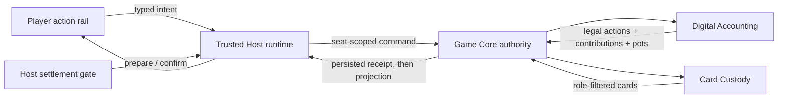

# Phase 2 digital-accounting architecture

**Status:** Active implementation reference for the first Phase 2 tracer slice. The Phase 2 and M10 PRDs remain normative.

## Current slice

The separate `/multiplayer/` preview defaults to Digital Chips while the retained
Phase 1 deployment remains unchanged. Digital betting advances streets through
committed actions, stages settlement for host confirmation, and supports another
hand after confirmation. Host-only `TopUpChips` increases an existing stack and
the session total atomically between hands, with idempotent receipts.

The original roster is retained after the first deal. New seats and manual
sit-out/return are unavailable until blind-aware re-entry is implemented.
Disconnect/reconnect and device replacement preserve the original seat. The next
hand uses fresh custody and a fresh hand ID, rotates the dealer, and deals only
to eligible seats with positive stacks. At least two such seats are required.

## Authority and privacy boundaries

- Presentation clients never mutate stacks, pots, or streets. They emit a `BettingActionIntent`.
- Game Core authenticates the seat actor and binds the action to the current hand and revision.
- Digital Accounting owns betting legality, contributions, street closure, derived pots, awards, and chip conservation.
- Card Custody remains the only deck/private-card owner. Public accounting projections contain play-chip values but no hidden cards.
- The Trusted Host evaluates eligible hands and proposes settlement. Confirmation is a separate host-only command.
- Deal-Only tables do not instantiate accounting state and retain the Phase 1 manual street/end-hand flow.

## Persistence and compatibility

Accounting state is included in the same atomic authority state as custody, revision, and idempotency receipts. The selected rules profile is also encrypted in host recovery state so a lobby can recover before Game Core exists. The Phase 2 development build uses protocol version 2; mixed Phase 1/Phase 2 peers fail compatibility checks instead of guessing message meaning.

## Implemented evidence

- Accounting contract tests cover heads-up blinds, calls/checks, full raises, folds, called all-ins, settlement staging, ties, odd-chip ordering, and conservation.
- Game Core contract tests cover seat-private legal actions, betting-driven street reveals, host-only settlement preparation, and post-confirmation balance mutation.
- A Chromium journey creates a Digital Chips table and completes a heads-up hand across one host and two player pages.

## Development continuation — 2026-09-13

The owner authorized continued Phase 2 development after accepting Phase 1.
The next accounting increment corrects postflop action order when the physical
seat immediately after the dealer has folded: rotate the full seating order
before filtering inactive seats. Legal actions also exclude raises and
aggressive all-ins when no opponent has chips left to respond; call/fold
remains available when facing an outstanding contribution.

`tests/contract/digital-accounting-multiway.test.ts` reproduces both previous
failures and covers a four-player hand with three nested pots, rejection of an
ineligible side-pot winner, confirmation-only awards, and duplicate settlement
rejection. Each accepted transition is checked by the accounting validator.
These are bounded contract vectors, not property or differential qualification.
No accounting schema, card projection, or experimental-entry gate changes.

Verification completed 2026-09-14 on local macOS:

- `pnpm check`: passed, including 109 contract tests and 19 relay tests.
- `pnpm test:coverage`: passed the configured thresholds.
- Independent bounded authority/privacy review: no introduced finding;
  independent digital-accounting contract run passed 14/14 tests.
- Full browser suite: 240 passed, 37 configured skips, 8 failed. The Digital
  Chips settlement journey passed in desktop Chromium, mobile Chromium, and
  mobile WebKit. Seven Chromium screenshot failures and one WebKit language
  alignment failure all reproduced when the accounting source was reverted
  to its pre-increment HEAD version for a baseline comparison. The new source
  was restored afterward. The full browser gate remains failing; baselines
  were not accepted or regenerated.

This evidence qualifies the bounded local increment only. It is neither a
clean browser release gate nor completion of Phase 2.

Remaining development order: short-all-in reopening and forced-blind edge
cases; multi-hand sessions and between-hand top-ups/return policy; append-only
correction and privacy-filtered history/export; remote Public Table and
Table-side/Airplane qualification. Phase 1 owner acceptance does not supply
missing physical-device evidence for Digital Chips.

## Betting and recovery increment — 2026-09-14

The accounting reducer now records each player's last acted bet for the
current street. A single short all-in preserves prior actors' closed raise
rights; cumulative short all-ins reopen only the players facing a full
increment. Unacted players retain their option. A below-minimum opening all-in
still requires a full increment for an unacted raise. The house-profile
interpretation and its evidence are recorded in the accounting foundation.

Short big blinds preserve the nominal multiway bring-in. A lone player cannot
bet into opponents who have no chips; once the required actual contributions
are matched, the reducer runs out the board. All-in blinds use that same
closure path directly from StartHand. Game Core applies those street events to
Card Custody before committing/projecting the hand, so public board state and
accounting reach showdown together. Zero-stack hand participants are rejected.

Accounting snapshots are now schema version 2 because schema 1 has no per-player
reopening evidence. Old experimental accounting snapshots fail closed through
the existing corrupt-state recovery result. There is no inferred migration;
finish experimental sessions before changing builds. Deal-Only state and
protocol projections are unchanged; last-action bookkeeping is not public.

New verification surfaces include ten betting-boundary vectors, three
recovery/authority tests, and 180 seeded two-to-ten-seat sequences asserting
nonnegative/conserved chips and deterministic command replay. Seven boundary
vectors fail against the saved pre-increment accounting source. These are
bounded regression and generative checks, not an independent settlement oracle.
The accounting package is now included in measured coverage.

Final local verification for this increment: `pnpm check` passed 123 contract
tests, 19 relay tests, builds, and static/documentation gates. Coverage including
accounting passed: overall statements 87.59%, branches 83.75%; accounting
statements 92.04%, branches 90.60%. The full browser suite completed in 12.9
minutes: 240 passed, 37 configured skips, and the same eight pre-existing UI
failures identified in the earlier baseline comparison. Digital Chips settlement
passed in desktop Chromium, mobile Chromium, and mobile WebKit. No screenshot
baselines were regenerated.

A fresh-context Luna/max reviewer checked the frozen accounting and Game Core
candidate plus the exact short-opening minimum-raise correction. The master
verified the final source matches that reviewed manifest and reran the 13
boundary/recovery tests. No unresolved finding remained within that bounded
review; it does not establish full Phase 2 release readiness.

## UI gate repair — 2026-09-14

The eight UI failures recorded above have now been resolved: seven test cases
used Darwin references that predated accepted presentation changes, and mobile
WebKit exposed insufficient vertical clearance around the home language switch.
The shared brand-bar inset is corrected; reviewed Darwin references and the
two affected Linux home/join references are current. Assertion tolerances and
configured skips are unchanged.

The final macOS browser run passed 248 tests with 37 existing configured skips
and zero failures in 11.3 minutes. A separate isolated Linux Chromium check
passed both the home/join visual comparison and bilingual creation geometry.
See [the UI repair evidence](../quality/UI-REGRESSION-REPAIR-2026-09-14.md) for
the cause, scope, and independent multi-agent diagnoses. This clears those
eight local browser failures; the Phase 2 development and physical-device
qualification gaps below remain open.

## Deliberately incomplete

The preview does not establish complete Phase 2 or party readiness. Late seats,
wait-for-big-blind re-entry, correction/reopen policy, privacy-filtered history
export, independent differential settlement tests, remote Public Table
qualification, and physical-device/Airplane verification remain open.

Earlier dated test results above are historical milestones. Current feedback and
release evidence belongs to [the preview record](../releases/PHASE-2-PREVIEW.md).

Preview re-entry boundary: an existing player may reload immediately after a
hand, including after reaching zero, before missing a subsequent deal. Once a
seat has sat out a deal, top-up/return is unavailable until blind-aware re-entry
is implemented. This does not change the settled wait-for-big-blind rule.
