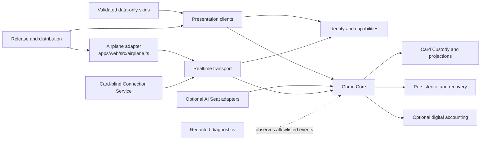

# Repository layout contract

**Status:** Accepted and active under [ADR-0007](../adr/0007-typescript-browser-monorepo-toolchain.md). Only directories needed by an implemented tracer slice are created.

The layout mirrors product ownership rather than UI pages. A module is “deep”: it owns a coherent policy and exposes a narrow interface, so callers do not need to reproduce its rules.

## Dependency view



Arrows mean “may call or provide an adapter to,” not “may inspect internal state.” Card Custody produces role-filtered projections before transport or presentation. The Connection Service never calls poker rules and never receives card plaintext or keys.

## Ownership tree (implemented today)

```text
html-poker-app/
├── assets/
│   ├── brand/                       # Canonical open-source identity sources and exports
│   └── product/                     # Approved product renders used by public documentation
├── apps/
│   └── web/                         # Browser shell and Table-side/Airplane composition
│       ├── public/                  # URL-only deployer config and notice bundle
│       └── src/                     # App, runtime, and Airplane QR/WebRTC adapter
├── packages/
│   ├── game-core/                   # Commands, events, rules, lifecycle
│   ├── card-custody/                # Shuffle, hidden state, projections
│   ├── identity-capabilities/       # Join, seats, credentials, authority
│   ├── realtime-transport/          # Protocol and P2P/relay adapters
│   ├── presentation/                # Player, Tablet, TV, Public table views
│   ├── persistence/                 # Commit, replay, checkpoint, recovery
│   ├── diagnostics/                 # Redacted schemas and support bundles
│   ├── accounting/                  # Optional play-chip betting, pots, settlement
├── services/
│   └── connection-service/          # Card-blind signaling, relay, ticket, pairing mailbox
├── tests/
│   ├── contract/                    # Public module interface behavior
│   ├── journey/                     # Supported user journeys and modes
│   └── security/                    # Privacy and adversarial tests
├── tools/
│   ├── branding/                    # Brand-package integrity and manifest verification
│   ├── documentation/               # Link, ID, manifest, and budget checks
│   └── release/                     # Reproducible build and provenance tools
├── docs/                            # Normative and explanatory documentation
└── .github/                         # Contribution templates and automation
```

The Airplane adapter deliberately lives in the web app because it is a browser delivery/bootstrap concern, while its message transport uses the same realtime boundary as Table-side Mode. Phase 2 instantiated `packages/accounting` for its first tracer slice. Phase 3 reserves `packages/skin-schema`, `packages/ai-seat`, and a separately isolated `services/ai-gateway`; they must not be added as empty directories merely to make the tree look complete.

## Dependency rules

1. `game-core` contains no browser DOM, network, database, AI-provider, or skin code.
2. `card-custody` is the only module allowed to hold deck order and unrevealed card plaintext in Phase 1. It returns role-specific projections, not its internal state.
3. Presentation sends typed intents; it does not mutate authoritative game state.
4. Transport carries authenticated envelopes and opaque projections; it does not interpret poker rules.
5. Persistence stores committed events and appropriately scoped encrypted custody state. Public history is a separately filtered projection.
6. Accounting is absent/disabled in Phase 1 and cannot be simulated implicitly from physical-chip play.
7. AI controllers propose seat-scoped actions through the same validation boundary as humans. Providers never become authoritative.
8. Skins provide validated data and assets only. They cannot execute code or alter hit targets, rules, permissions, or hidden-state filtering.
9. Diagnostics consumes an allowlisted redacted schema. It never receives raw objects and “removes secrets later.”
10. Connection Service and AI Gateway are separate trust domains even if deployed on the same computer.

## Interface and versioning rules

- Commands express requested intent; only the authority commits events.
- Every accepted command has an idempotency key and yields a committed revision or an explicit rejection.
- Events are immutable. Corrections append new events and retain causal references.
- Persist before acknowledging success or exposing an irreversible projection.
- Table invitations pin compatible protocol, rules-profile, host identity, and release information.
- Public schemas are versioned independently from internal implementation and include compatibility tests.
- Unknown fields are handled according to the schema version, never by silently guessing poker meaning.

## Placement test

Before adding code, ask which module owns the policy. If two callers would otherwise implement the same privacy, legality, recovery, or authority rule, deepen the owning module instead of creating a shared utility. A utility may format bytes or parse data; it must not become an unnamed policy module.

Canonical brand sources and reusable exports live in `assets/brand/`. Runtime
applications import or copy only the approved files they actually use; the
complete marketing and high-resolution package does not enter every build by
default. Brand rules and provenance live in `docs/design/brand/`. Approved
product-proof renders live separately in `assets/product/` so screenshots do
not become canonical logo sources or enter runtime bundles by accident.

## Creation rule

Implementation directories are created only when a tracer slice needs them. ADR-0007 selects the language, workspace, browser-build, and test tooling; it does not authorize empty packages for later phases.
